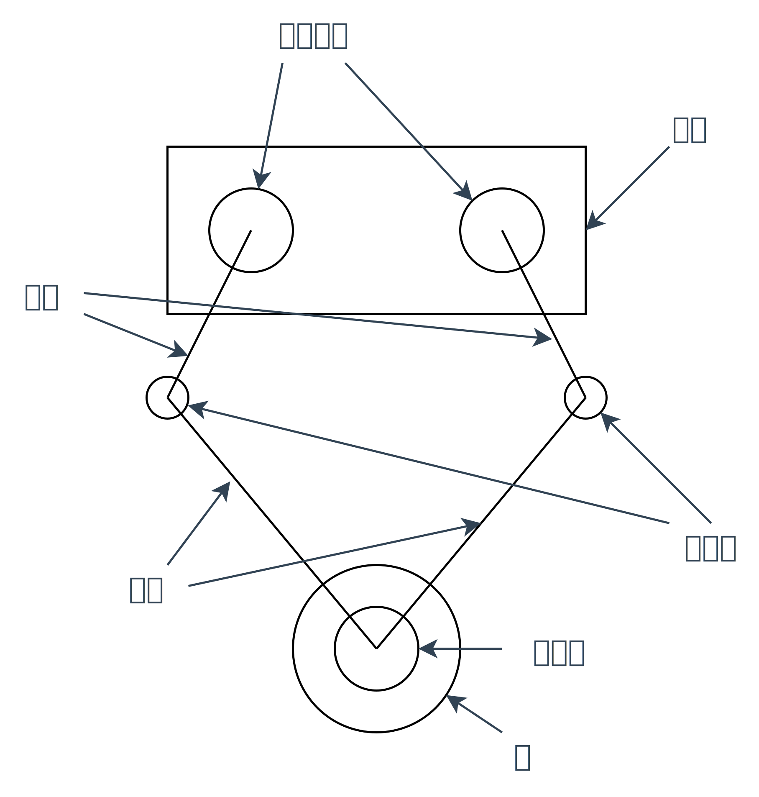
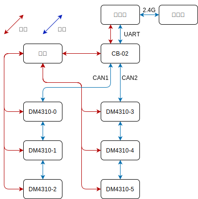
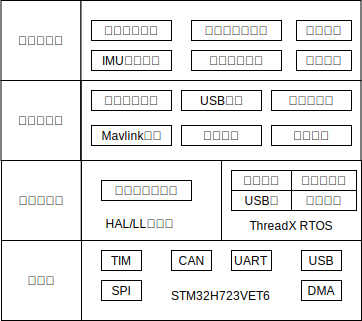

# BananaBot - Balancing Robot Type B
BananaBot is a kind of five-link dual-wheel balancing robot. It's based on balancing infantry robot in the RoboMaster competition.
BananaBot is a graduate design of Dalian University of Technology.

## Overall of robot

BananaBot has three main components: the body-box, the legs, and the wheels. The structural design and kinematic model derivation are both based on this.

Here lists more paramaters about robot:

| Parameter Name                  | Value | Unit  |
|---------------------------------|-------|-------|
| Mass                            | 3.9   | kg    |
| Maximum Load                    | 2.5   | kg    |
| Maximum Acceleration            | 1.0   | m/s²  |
| Maximum Linear Velocity         | 1.2   | m/s   |
| Maximum Jump Height             | 0.2   | m     |
| Shortest Effective Pendulum Length | 0.12  | m     |
| Longest Effective Pendulum Length  | 0.32  | m     |
| Maximum Left-Right Pendulum Height Difference | 0.15  | m     |
| Endurance Time                  | 1.0   | h     |

Here is the hardware connection of BananaBot:

##  Kinematic of robot
The build of the kinematic model is based on this paper[^1]. The robot is approximated as an inverted pendulum model composed of a body-box, a rigid pendulum rod, and wheels. And we construct the rotational and translational kinematic equations for this system.

The system state variables are defined as:
\[
\mathbf{x} = [\theta, \dot{\theta}, x, \dot{x}, \phi, \dot{\phi}] \quad (3.10)
\]

The system output variables are defined as:
\[
\mathbf{u} = [T, T_p] \quad (3.11)
\]

Simplify using MATLAB symbolic computation and linearize around the equilibrium point. This content can be found in the MATLAB folder, as _LQRModule.m_.

## Controller of Robot

We have the following main controllers:

- LQR Controller
- Equivalent Pendulum Length Controller
- Fork Controller
- Heading Angle Controller
- Roll Angle Controller

As well as the following observers:

- Body Attitude EKF (Extended Kalman Filter)
- Anti-skid KF (Kalman Filter)

And the transformation:

- VMC Transformation

Among them, the VMC (Virtual Model Control) controller utilizes the statics of a five-bar linkage to achieve bidirectional force mapping between the pendulum and the motors.

## Software
- Code generator: [STM32CubeMX-6.11.1](https://www.st.com/zh/development-tools/stm32cubemx.html)
- Tools chains: [arm-none-eabi-gcc](https://developer.arm.com/downloads/-/arm-gnu-toolchain-downloads)
- Debugger: [OpenOCD](https://github.com/xpack-dev-tools/openocd-xpack/releases) + GDB(Windows need [mingw64](https://github.com/skeeto/w64devkit/releases))
- STM32CubeH7 Firmware Package V1.11.0 / 04-Nov-2022
- STM32CubeExpansion_AZRTOS-H7 V3.2.0
- [OneMessage - Message System](Module/OneMessage/README.md)
- [WHX EKF - AHRS](https://github.com/WangHongxi2001/RoboMaster-C-Board-INS-Example)
  
Software construction list here:

> USB and Mavlink haven't completed
> This picture isn't 100% fit the truth, LOL

[^1]: 陈阳, 王洪玺, 张兰勇. 轮腿式平衡机器人控制[J]. 信息与控制, 2023, 52(05): 648-659. https://doi.org/10.13976/j.cnki.xk.2023.2533.

